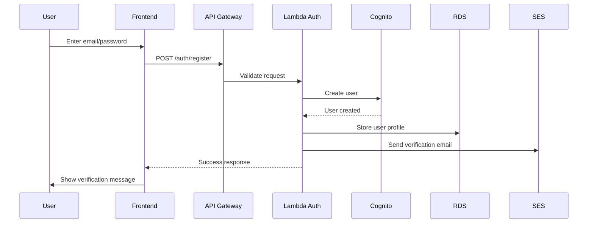
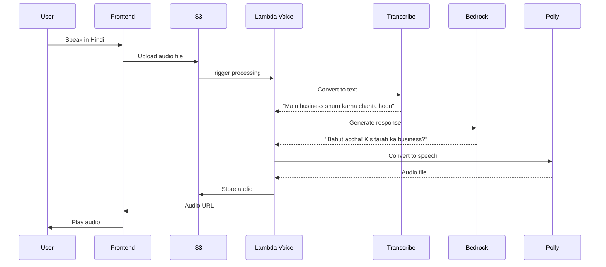
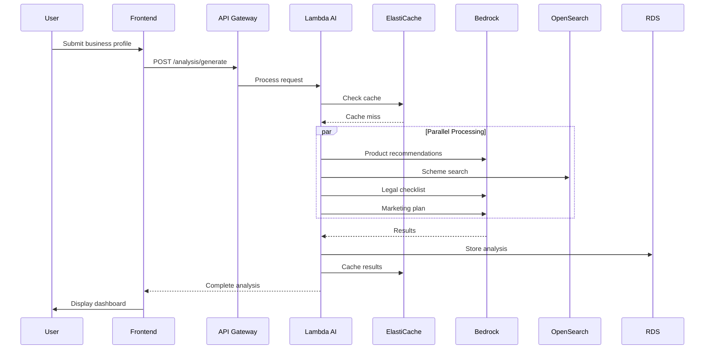

# Startup Saathi - Design Document

**Project Name:** Startup Saathi (स्टार्टअप साथी)  
**Version:** 1.0  
**Date:** February 2026  
**Hackathon:** AI for Bharat AWS Hackathon  
**Architecture:** AWS-Native, Cost-Optimized, Serverless-First

## 1. System Architecture Overview

### 1.1 High-Level Architecture

```
┌─────────────────────────────────────────────────────────────────┐
│                         USERS                                   │
│  Mobile Web (PWA) | Desktop Web | Voice Interface | WhatsApp    │
└────────────────────────────┬────────────────────────────────────┘
                             │
                             ▼
┌─────────────────────────────────────────────────────────────────┐
│                    CLOUDFRONT (CDN)                             │
│  - Global edge locations                                        │
│  - SSL/TLS termination                                          │
│  - DDoS protection (AWS Shield)                                 │
└────────────────────────────┬────────────────────────────────────┘
                             │
                             ▼
┌─────────────────────────────────────────────────────────────────┐
│                    API GATEWAY (REST)                           │
│  - Rate limiting (100 req/min/user)                             │
│  - Request validation                                           │
│  - API key management                                           │
│  - CORS configuration                                           │
└────────────────────────────┬────────────────────────────────────┘
                             │
              ┌──────────────┴──────────────┐
              │                             │
              ▼                             ▼
┌──────────────────────────┐   ┌──────────────────────────┐
│   LAMBDA FUNCTIONS       │   │   ECS FARGATE            │
│   (Serverless)           │   │   (Containerized)        │
│                          │   │                          │
│  - Auth Handler          │   │  - Next.js App           │
│  - Voice Processor       │   │  - API Routes            │
│  - Notification Service  │   │  - SSR Pages             │
│  - Scheme Matcher        │   │                          │
└──────────┬───────────────┘   └────────┬─────────────────┘
           │                            │
           └────────────┬───────────────┘
                        │
        ┌───────────────┴───────────────┐
        │                               │
        ▼                               ▼
┌──────────────────┐          ┌──────────────────┐
│  AI SERVICES     │          │  DATA LAYER      │
│                  │          │                  │
│  - Bedrock       │          │  - RDS Postgres  │
│  - Transcribe    │          │  - OpenSearch    │
│  - Polly         │          │  - ElastiCache   │
│  - Rekognition   │          │  - S3            │
└──────────────────┘          └──────────────────┘
```

### 1.2 Architecture Principles

1. **Serverless-First:** Use Lambda for event-driven, variable workloads
2. **Cost-Optimized:** Leverage AWS Free Tier, spot instances, reserved capacity
3. **Scalable:** Auto-scaling from 100 to 10,000+ concurrent users
4. **Resilient:** Multi-AZ deployment, automated failover
5. **Secure:** Encryption at rest/transit, IAM least privilege
6. **Observable:** CloudWatch metrics, X-Ray tracing, structured logging

## 2. Detailed Component Design

### 2.1 Frontend Layer

#### 2.1.1 Technology Stack
- **Framework:** Next.js 14 (App Router)
- **Language:** TypeScript
- **Styling:** Tailwind CSS
- **State Management:** React Context + Zustand
- **Forms:** React Hook Form + Zod validation
- **HTTP Client:** Axios with retry logic
- **PWA:** next-pwa plugin

#### 2.1.2 Key Pages

1. `/` - Landing page (static, cached on CloudFront)
2. `/onboarding` - Multi-step form (voice/text input)
3. `/dashboard` - Results page (schemes, legal, marketing)
4. `/schemes/[id]` - Scheme detail page
5. `/chat` - Conversational AI interface
6. `/profile` - User settings

#### 2.1.3 Deployment
- **Hosting:** ECS Fargate (for SSR) OR S3 + CloudFront (for SSG)
- **Build:** GitHub Actions CI/CD
- **Environment:** Dev, Staging, Production
- **CDN:** CloudFront with edge caching (TTL: 1 hour for static, 5 min for dynamic)

### 2.2 API Layer

#### 2.2.1 API Gateway Configuration
```yaml
API Gateway REST API:
  Name: startup-saathi-api
  Stage: prod
  Throttling:
    Rate: 1000 requests/second
    Burst: 2000 requests
  
  Resources:
    /auth:
      POST /login
      POST /register
      POST /refresh
    
    /voice:
      POST /transcribe
      POST /synthesize
    
    /analysis:
      POST /product-recommendations
      POST /scheme-matching
      POST /legal-checklist
      POST /marketing-plan
    
    /chat:
      POST /message
      GET /history
    
    /schemes:
      GET /list
      GET /{id}
    
    /notifications:
      POST /subscribe
      GET /preferences
```

#### 2.2.2 Lambda Functions

**Function 1: Auth Handler**
- Runtime: Node.js 20.x
- Memory: 512 MB
- Timeout: 10 seconds
- Triggers: API Gateway
- Purpose: JWT generation, validation, refresh
- Cold start optimization: Provisioned concurrency (2 instances)

**Function 2: Voice Processor**
- Runtime: Python 3.12
- Memory: 1024 MB
- Timeout: 30 seconds
- Triggers: API Gateway, S3 (audio upload)
- Purpose: Orchestrate Transcribe → Language Detection → Response
- Async: Uses SQS for long-running transcriptions

**Function 3: AI Orchestrator**
- Runtime: Node.js 20.x
- Memory: 2048 MB
- Timeout: 5 minutes
- Triggers: API Gateway
- Purpose: Coordinate Bedrock calls, caching, response formatting
- Optimization: Response streaming for faster UX

**Function 4: Scheme Matcher**
- Runtime: Python 3.12
- Memory: 1024 MB
- Timeout: 2 minutes
- Triggers: API Gateway
- Purpose: Vector search in OpenSearch, AI ranking
- Caching: ElastiCache for frequent queries

**Function 5: Notification Dispatcher**
- Runtime: Node.js 20.x
- Memory: 512 MB
- Timeout: 1 minute
- Triggers: EventBridge (scheduled), DynamoDB Streams
- Purpose: Send SMS/Email/WhatsApp notifications
- Batch processing: Up to 100 notifications per invocation

### 2.3 AI Services Layer

#### 2.3.1 Amazon Bedrock (Primary AI)

**Model Selection:**
- **Primary:** Claude 3.5 Sonnet (anthropic.claude-3-5-sonnet-20241022-v2:0)
  - Reasoning: Best balance of cost, quality, speed
  - Context window: 200K tokens
  - Cost: $3/1M input tokens, $15/1M output tokens
  
**Use Cases:**
1. Product Recommendations
2. Scheme Matching (relevance scoring)
3. Legal Checklist Generation
4. Marketing Plan Creation
5. Conversational Chat
6. Document Analysis

**Prompt Engineering Strategy:**
```python
# System Prompt Template
SYSTEM_PROMPT = """
You are Startup Saathi, an AI business advisor for Indian entrepreneurs.

Context:
- User Language: {language}
- Business Type: {business_type}
- Location: {location}
- Stage: {stage}

Guidelines:
- Use simple, jargon-free language
- Provide actionable, specific advice
- Include Indian context (schemes, regulations, market)
- Be encouraging and supportive
- Cite sources when providing factual information

Response Format: {format_instructions}
"""
```

**Optimization Techniques:**
- Prompt caching for system prompts (50% cost reduction)
- Response streaming for better UX
- Batch inference for non-real-time tasks
- Fallback to GPT-4 if Bedrock unavailable

#### 2.3.2 Amazon Transcribe (Voice-to-Text)

**Configuration:**
```json
{
  "LanguageCode": "hi-IN",
  "MediaFormat": "wav",
  "MediaSampleRateHertz": 16000,
  "Settings": {
    "ShowSpeakerLabels": false,
    "MaxSpeakerLabels": 1,
    "ChannelIdentification": false,
    "ShowAlternatives": true,
    "MaxAlternatives": 2,
    "VocabularyName": "startup-terms"
  },
  "IdentifyLanguage": true,
  "LanguageOptions": [
    "hi-IN", "en-IN", "ta-IN", "te-IN", "bn-IN", 
    "mr-IN", "gu-IN", "kn-IN", "ml-IN", "pa-IN"
  ]
}
```

**Custom Vocabulary:**
- Startup terms: DPIIT, SISFS, PMFME, GST, FSSAI
- Business jargon: tiffin service, cloud kitchen, D2C
- Indian names and places

**Cost Optimization:**
- Use standard (not real-time) for async processing
- Batch multiple audio files
- Cost: $0.024/minute (standard), $0.0004/second (streaming)

#### 2.3.3 Amazon Polly (Text-to-Speech)

**Configuration:**
```python
polly_config = {
    "Engine": "neural",  # Higher quality
    "LanguageCode": "hi-IN",
    "VoiceId": "Kajal",  # Female Hindi voice
    "OutputFormat": "mp3",
    "SampleRate": "24000",
    "TextType": "ssml"  # For pronunciation control
}
```

**Supported Voices:**
- Hindi: Kajal (Female), Aditi (Female)
- Tamil: Not available (use Google TTS as fallback)
- English (Indian): Aditi, Raveena

**Cost:** $16/1M characters (Neural), $4/1M (Standard)

#### 2.3.4 Amazon Rekognition (Image Analysis)

**Use Cases:**
- Product photo quality assessment
- Label detection (for categorization)
- Text extraction (OCR for documents)
- Inappropriate content detection

**API Calls:**
- `DetectLabels`: Identify product type
- `DetectText`: Extract text from images
- `DetectModerationLabels`: Content safety

**Cost:** $1/1000 images (first 1M images/month)

### 2.4 Data Layer

#### 2.4.1 Amazon RDS (PostgreSQL)

**Configuration:**
- **Instance:** db.t4g.micro (Free Tier) → db.t4g.small (production)
- **Engine:** PostgreSQL 15.4
- **Storage:** 20 GB GP3 (Free Tier) → 100 GB (production)
- **Multi-AZ:** No (dev), Yes (production)
- **Backup:** Automated daily, 7-day retention
- **Encryption:** AES-256 at rest

**Schema Design:**

```sql
-- Users table
CREATE TABLE users (
    id UUID PRIMARY KEY DEFAULT gen_random_uuid(),
    email VARCHAR(255) UNIQUE NOT NULL,
    phone VARCHAR(20),
    password_hash VARCHAR(255),
    preferred_language VARCHAR(10) DEFAULT 'en',
    location JSONB,
    subscription_tier VARCHAR(20) DEFAULT 'free',
    created_at TIMESTAMP DEFAULT NOW(),
    updated_at TIMESTAMP DEFAULT NOW()
);

-- Business profiles
CREATE TABLE business_profiles (
    id UUID PRIMARY KEY DEFAULT gen_random_uuid(),
    user_id UUID REFERENCES users(id) ON DELETE CASCADE,
    business_idea TEXT,
    industry VARCHAR(100),
    stage VARCHAR(50),
    budget_range VARCHAR(50),
    skills JSONB,
    created_at TIMESTAMP DEFAULT NOW()
);

-- Analyses
CREATE TABLE analyses (
    id UUID PRIMARY KEY DEFAULT gen_random_uuid(),
    profile_id UUID REFERENCES business_profiles(id),
    product_recommendations JSONB,
    scheme_matches JSONB,
    legal_checklist JSONB,
    marketing_plan JSONB,
    created_at TIMESTAMP DEFAULT NOW()
);

-- Government schemes
CREATE TABLE government_schemes (
    id UUID PRIMARY KEY DEFAULT gen_random_uuid(),
    name VARCHAR(255) NOT NULL,
    ministry VARCHAR(255),
    description TEXT,
    eligibility JSONB,
    benefits JSONB,
    application_url TEXT,
    deadline DATE,
    last_updated TIMESTAMP DEFAULT NOW()
);

-- Conversations
CREATE TABLE conversations (
    id UUID PRIMARY KEY DEFAULT gen_random_uuid(),
    user_id UUID REFERENCES users(id),
    messages JSONB,
    context JSONB,
    language VARCHAR(10),
    mode VARCHAR(10),
    created_at TIMESTAMP DEFAULT NOW(),
    updated_at TIMESTAMP DEFAULT NOW()
);

-- Notifications
CREATE TABLE notifications (
    id UUID PRIMARY KEY DEFAULT gen_random_uuid(),
    user_id UUID REFERENCES users(id),
    type VARCHAR(50),
    content JSONB,
    sent_at TIMESTAMP,
    read_at TIMESTAMP,
    channel VARCHAR(20)
);

-- Indexes for performance
CREATE INDEX idx_users_email ON users(email);
CREATE INDEX idx_business_profiles_user_id ON business_profiles(user_id);
CREATE INDEX idx_analyses_profile_id ON analyses(profile_id);
CREATE INDEX idx_schemes_ministry ON government_schemes(ministry);
CREATE INDEX idx_conversations_user_id ON conversations(user_id);
CREATE INDEX idx_notifications_user_id ON notifications(user_id);
```

#### 2.4.2 Amazon OpenSearch Service (Vector Search)

**Purpose:** Semantic search for government schemes

**Configuration:**
- Instance: t3.small.search
- Storage: 10 GB EBS
- Replicas: 1 (for availability)

**Index Structure:**
```json
{
  "mappings": {
    "properties": {
      "scheme_id": { "type": "keyword" },
      "name": { "type": "text" },
      "description": { "type": "text" },
      "embedding": {
        "type": "knn_vector",
        "dimension": 1536
      },
      "eligibility": { "type": "object" },
      "benefits": { "type": "object" }
    }
  }
}
```

**Search Query:**
```python
def search_schemes(user_query_embedding, filters):
    query = {
        "size": 10,
        "query": {
            "bool": {
                "must": [
                    {
                        "knn": {
                            "embedding": {
                                "vector": user_query_embedding,
                                "k": 10
                            }
                        }
                    }
                ],
                "filter": filters  # Industry, location, stage
            }
        }
    }
    return opensearch_client.search(index="schemes", body=query)
```

#### 2.4.3 Amazon ElastiCache (Redis)

**Use Cases:**
1. Session management (JWT tokens)
2. API response caching
3. Rate limiting counters
4. Conversation context (temporary)

**Cache Strategy:**
```python
# Cache scheme data (24 hours)
cache_key = f"scheme:{scheme_id}"
ttl = 86400  # 24 hours

# Cache AI responses (1 hour)
cache_key = f"ai_response:{hash(prompt)}"
ttl = 3600  # 1 hour

# Cache user profile (15 minutes)
cache_key = f"user:{user_id}"
ttl = 900  # 15 minutes
```

#### 2.4.4 Amazon S3 (Object Storage)

**Bucket Structure:**
```
startup-saathi-prod/
├── audio-uploads/
│   ├── {user_id}/
│   │   └── {timestamp}.wav
│   └── lifecycle: delete after 7 days
├── user-documents/
│   ├── {user_id}/
│   │   └── {document_id}.pdf
│   └── lifecycle: archive to Glacier after 90 days
├── static-assets/
│   ├── images/
│   ├── videos/
│   └── documents/
└── backups/
    └── database/
```

**Lifecycle Policies:**
```json
{
  "Rules": [
    {
      "Id": "DeleteOldAudio",
      "Status": "Enabled",
      "Prefix": "audio-uploads/",
      "Expiration": {
        "Days": 7
      }
    },
    {
      "Id": "ArchiveDocuments",
      "Status": "Enabled",
      "Prefix": "user-documents/",
      "Transitions": [
        {
          "Days": 90,
          "StorageClass": "GLACIER"
        }
      ]
    }
  ]
}
```

### 2.5 Security Architecture

#### 2.5.1 Authentication Flow

```
User Login Request
       ↓
API Gateway
       ↓
Lambda: auth-handler
       ↓
AWS Cognito (verify credentials)
       ↓
Generate JWT (access + refresh tokens)
       ↓
Store refresh token in ElastiCache
       ↓
Return tokens to client
       ↓
Client stores in httpOnly cookie
```

#### 2.5.2 Authorization

**JWT Payload:**
```json
{
  "sub": "user_id",
  "email": "user@example.com",
  "tier": "free",
  "iat": 1234567890,
  "exp": 1234571490
}
```

**API Gateway Authorizer:**
- Lambda authorizer validates JWT
- Checks token expiration
- Verifies signature
- Returns IAM policy (allow/deny)

#### 2.5.3 Data Encryption

**At Rest:**
- RDS: AES-256 encryption
- S3: SSE-S3 (server-side encryption)
- ElastiCache: Encryption enabled
- Secrets Manager: Automatic encryption

**In Transit:**
- HTTPS/TLS 1.3 for all communications
- Certificate Manager for SSL certificates
- CloudFront enforces HTTPS

#### 2.5.4 Network Security

**VPC Configuration:**
```
VPC: 10.0.0.0/16
├── Public Subnets (2 AZs)
│   ├── 10.0.1.0/24 (us-east-1a)
│   └── 10.0.2.0/24 (us-east-1b)
│   └── Resources: ALB, NAT Gateway
├── Private Subnets (2 AZs)
│   ├── 10.0.11.0/24 (us-east-1a)
│   └── 10.0.12.0/24 (us-east-1b)
│   └── Resources: ECS/EC2, Lambda
└── Database Subnets (2 AZs)
    ├── 10.0.21.0/24 (us-east-1a)
    └── 10.0.22.0/24 (us-east-1b)
    └── Resources: RDS, ElastiCache, OpenSearch
```

**Security Groups:**
- ALB: Allow 80, 443 from 0.0.0.0/0
- App Servers: Allow 8080 from ALB only
- RDS: Allow 5432 from App Servers only
- ElastiCache: Allow 6379 from App Servers only

#### 2.5.5 WAF Rules

```json
{
  "Rules": [
    {
      "Name": "RateLimitRule",
      "Priority": 1,
      "Action": "Block",
      "RateLimit": 2000
    },
    {
      "Name": "SQLInjectionRule",
      "Priority": 2,
      "Action": "Block",
      "ManagedRuleGroupStatement": "AWSManagedRulesSQLiRuleSet"
    },
    {
      "Name": "XSSRule",
      "Priority": 3,
      "Action": "Block",
      "ManagedRuleGroupStatement": "AWSManagedRulesKnownBadInputsRuleSet"
    }
  ]
}
```

## 3. Key Workflows

### 3.1 Voice Onboarding Workflow

```
User clicks "Start with Voice"
       ↓
Frontend: Request microphone permission
       ↓
User speaks in Hindi
       ↓
Frontend: Record audio (WAV, 16kHz)
       ↓
Upload to S3 (audio-uploads/)
       ↓
Trigger Lambda: voice-processor
       ↓
Amazon Transcribe: Convert to text
       ↓
Detect language (hi-IN)
       ↓
Store in ElastiCache (conversation context)
       ↓
Send text to Bedrock for response
       ↓
Bedrock generates Hindi response
       ↓
Amazon Polly: Convert to speech
       ↓
Return audio URL to frontend
       ↓
Frontend plays audio
       ↓
Repeat for multi-turn conversation
```

### 3.2 AI Analysis Workflow

```
User completes onboarding
       ↓
Frontend: Submit profile data
       ↓
API Gateway → Lambda: ai-orchestrator
       ↓
Check ElastiCache for cached results
       ↓
If cache miss:
  ├→ Parallel execution:
  │  ├→ Product Recommendations (Bedrock)
  │  ├→ Scheme Matching (OpenSearch + Bedrock)
  │  ├→ Legal Checklist (Rule engine + Bedrock)
  │  └→ Marketing Plan (Bedrock)
  ↓
Aggregate results
       ↓
Store in RDS (analyses table)
       ↓
Cache in ElastiCache (1 hour TTL)
       ↓
Return to frontend
       ↓
Frontend displays dashboard
```

### 3.3 Scheme Matching Workflow

```
User profile: {
  business_type: "food",
  location: "Delhi",
  stage: "idea",
  budget: "50000-200000"
}
       ↓
Lambda: scheme-matcher
       ↓
Step 1: Broad filter (SQL query)
  SELECT * FROM government_schemes
  WHERE industry = 'food'
    AND location IN ('Delhi', 'All India')
    AND stage IN ('idea', 'early')
       ↓
Step 2: Generate embedding (Bedrock)
  user_query = "Food business in Delhi, idea stage, 2L budget"
  embedding = bedrock.embed(user_query)
       ↓
Step 3: Vector search (OpenSearch)
  Search schemes by embedding similarity
  Top 20 results
       ↓
Step 4: AI ranking (Bedrock)
  Prompt: "Rank these schemes for this user profile"
  Return top 5 with scores
       ↓
Step 5: Generate application guidance (Bedrock)
  For each scheme:
    - Eligibility check
    - Document checklist
    - Step-by-step process
    - Success tips
       ↓
Return results to user
```

### 3.4 Notification Workflow

```
EventBridge: Daily cron (9 AM IST)
       ↓
Trigger Lambda: notification-dispatcher
       ↓
Query RDS: Get users with upcoming deadlines
  SELECT * FROM notifications
  WHERE sent_at IS NULL
    AND scheduled_for <= NOW() + INTERVAL '3 days'
       ↓
For each user:
  ├→ Check notification preferences
  ├→ Filter by relevance score (>80%)
  ├→ Personalize message (Bedrock)
  └→ Send via preferred channel:
      ├→ SMS (Amazon SNS)
      ├→ Email (Amazon SES)
      ├→ WhatsApp (Twilio API)
      └→ In-app (store in DB)
       ↓
Mark as sent in database
       ↓
Log to CloudWatch
```

## 4. Data Flow Diagrams

### 4.1 User Registration Flow



### 4.2 Voice Interaction Flow



### 4.3 AI Analysis Flow



## 5. Deployment Architecture

### 5.1 CI/CD Pipeline

```
GitHub Repository
       ↓
Push to main branch
       ↓
GitHub Actions / CodePipeline
       ↓
┌─────────────────────────────┐
│  Build Stage                │
│  - npm install              │
│  - npm run build            │
│  - Run tests                │
│  - Build Docker image       │
└─────────────┬───────────────┘
              ↓
┌─────────────────────────────┐
│  Test Stage                 │
│  - Unit tests               │
│  - Integration tests        │
│  - Security scan            │
└─────────────┬───────────────┘
              ↓
┌─────────────────────────────┐
│  Deploy to Staging          │
│  - Update ECS task          │
│  - Run smoke tests          │
│  - Manual approval          │
└─────────────┬───────────────┘
              ↓
┌─────────────────────────────┐
│  Deploy to Production       │
│  - Blue/Green deployment    │
│  - Health checks            │
│  - Rollback on failure      │
└─────────────────────────────┘
```

### 5.2 Infrastructure as Code

**Terraform Structure:**
```
terraform/
├── modules/
│   ├── networking/
│   │   ├── vpc.tf
│   │   ├── subnets.tf
│   │   └── security_groups.tf
│   ├── compute/
│   │   ├── ecs.tf
│   │   ├── lambda.tf
│   │   └── alb.tf
│   ├── data/
│   │   ├── rds.tf
│   │   ├── elasticache.tf
│   │   └── opensearch.tf
│   └── ai/
│       ├── bedrock.tf
│       ├── transcribe.tf
│       └── polly.tf
├── environments/
│   ├── dev/
│   ├── staging/
│   └── prod/
└── main.tf
```

### 5.3 Monitoring & Alerting

**CloudWatch Alarms:**
```yaml
Alarms:
  - Name: HighCPUUtilization
    Metric: CPUUtilization
    Threshold: 80%
    Action: SNS notification + Auto-scale
  
  - Name: HighErrorRate
    Metric: 5XXError
    Threshold: 5%
    Action: SNS notification + PagerDuty
  
  - Name: HighLatency
    Metric: TargetResponseTime
    Threshold: 2000ms
    Action: SNS notification
  
  - Name: LowDiskSpace
    Metric: FreeStorageSpace
    Threshold: 10%
    Action: SNS notification
```

**CloudWatch Dashboard:**
- Request count (per minute)
- Error rate (4XX, 5XX)
- Latency (p50, p95, p99)
- Lambda invocations
- Bedrock token usage
- Database connections
- Cache hit rate

## 6. Scalability & Performance

### 6.1 Auto-Scaling Configuration

**ECS Service Auto-Scaling:**
```json
{
  "ServiceName": "startup-saathi-app",
  "MinCapacity": 1,
  "MaxCapacity": 10,
  "TargetTrackingScaling": {
    "TargetValue": 70.0,
    "PredefinedMetricType": "ECSServiceAverageCPUUtilization",
    "ScaleInCooldown": 300,
    "ScaleOutCooldown": 60
  }
}
```

**Lambda Concurrency:**
- Reserved concurrency: 100 (per function)
- Provisioned concurrency: 2 (for auth-handler)

### 6.2 Caching Strategy

**Multi-Layer Caching:**
```
Request
  ↓
CloudFront (Edge cache, TTL: 1 hour)
  ↓ Cache miss
API Gateway (API cache, TTL: 5 min)
  ↓ Cache miss
ElastiCache (Application cache, TTL: 15 min)
  ↓ Cache miss
Database (RDS)
```

**Cache Invalidation:**
- Scheme data: Invalidate on weekly update
- User profile: Invalidate on update
- AI responses: TTL-based expiration

### 6.3 Database Optimization

**Read Replicas:**
- 1 read replica for reporting queries
- Route read traffic to replica
- Reduce load on primary

**Connection Pooling:**
```javascript
const pool = new Pool({
  host: process.env.DB_HOST,
  database: process.env.DB_NAME,
  max: 20,  // Max connections
  idleTimeoutMillis: 30000,
  connectionTimeoutMillis: 2000,
});
```

**Query Optimization:**
- Use indexes on frequently queried columns
- Avoid N+1 queries (use JOINs)
- Paginate large result sets
- Use EXPLAIN ANALYZE for slow queries

## 7. Disaster Recovery

### 7.1 Backup Strategy

**RDS Automated Backups:**
- Daily snapshots at 3 AM UTC
- Retention: 7 days
- Cross-region replication (optional)

**S3 Versioning:**
- Enable versioning for critical buckets
- Lifecycle policy: Keep 30 versions

**Database Exports:**
- Weekly full export to S3
- Encrypted with KMS

### 7.2 Recovery Procedures

**RTO (Recovery Time Objective):** 4 hours  
**RPO (Recovery Point Objective):** 24 hours

**Recovery Steps:**
1. Restore RDS from latest snapshot (30 min)
2. Update DNS to point to new instance (5 min)
3. Restore S3 data if needed (1 hour)
4. Verify application functionality (30 min)
5. Monitor for issues (2 hours)

## 8. Compliance & Privacy

### 8.1 DPDPA Compliance

**Data Collection:**
- Explicit consent for data collection
- Clear privacy policy
- Option to delete account

**Data Storage:**
- Encryption at rest and in transit
- Access logs for audit
- Data retention policies

**Data Deletion:**
- User can request data deletion
- Automated deletion after 90 days of inactivity
- Audio files deleted after 7 days

### 8.2 Security Best Practices

**IAM Policies:**
- Least privilege access
- MFA for admin accounts
- Regular access reviews

**Secrets Management:**
- Store API keys in Secrets Manager
- Rotate secrets every 90 days
- Never commit secrets to Git

**Logging:**
- CloudTrail for API calls
- VPC Flow Logs for network traffic
- Application logs to CloudWatch

## 9. Testing Strategy

### 9.1 Unit Tests
- Jest for JavaScript/TypeScript
- Pytest for Python
- Coverage target: 80%

### 9.2 Integration Tests
- Test API endpoints
- Test Lambda functions
- Test database queries

### 9.3 Load Tests
- Apache JMeter or Locust
- Simulate 1,000 concurrent users
- Identify bottlenecks

### 9.4 Security Tests
- OWASP ZAP for vulnerability scanning
- Penetration testing (quarterly)
- Dependency scanning (Snyk)

## 10. Data Sources & Collection Strategy

### 10.1 Overview

The platform requires multiple datasets to provide personalized recommendations. This section details data sources, collection methods, storage strategies, and update frequencies.

### 10.2 Government Schemes Database (500+ schemes)

**Target:** 500+ central and state government schemes

**Data Sources:**

1. **Startup India Portal** (https://www.startupindia.gov.in)
   - Central schemes (SISFS, PMFME, etc.)
   - API: Check for public API availability
   - Scraping: Weekly automated scraping if no API

2. **Ministry Websites**
   - DPIIT (Department for Promotion of Industry and Internal Trade)
   - Ministry of MSME
   - Ministry of Agriculture
   - Ministry of Electronics & IT
   - State-specific startup portals (28 states + 8 UTs)

3. **Government Portals**
   - MyGov.in
   - India.gov.in
   - State government websites

**Data Structure:**
```json
{
  "scheme_id": "SISFS-2024",
  "name": "Startup India Seed Fund Scheme",
  "name_translations": {
    "hi": "स्टार्टअप इंडिया सीड फंड योजना",
    "ta": "ஸ்டார்ட்அப் இந்தியா விதை நிதி திட்டம்"
  },
  "ministry": "DPIIT",
  "type": "seed_funding",
  "description": "Provides financial assistance to startups...",
  "eligibility": {
    "industry": ["all"],
    "stage": ["idea", "early"],
    "location": ["All India"],
    "entity_type": ["Private Limited", "LLP"],
    "turnover_max": 2500000,
    "age_max_months": 24,
    "gender": "all",
    "category": ["General", "SC", "ST", "OBC"]
  },
  "benefits": {
    "grant_amount": "up to ₹20 lakhs",
    "grant_type": "seed_funding",
    "additional": ["mentorship", "incubation"]
  },
  "application_url": "https://seedfund.startupindia.gov.in",
  "deadline": "2024-12-31",
  "documents_required": [
    "Business plan",
    "Incorporation certificate",
    "DPIIT recognition"
  ],
  "success_rate": 15.5,
  "avg_processing_days": 90,
  "last_updated": "2024-02-15",
  "source_url": "https://..."
}
```

**Collection Method:**

**Phase 1: Manual Curation (MVP - 50 schemes)**
```python
# Manual data entry for top 50 schemes
schemes = [
    {
        "scheme_id": "SISFS-2024",
        "name": "Startup India Seed Fund Scheme",
        # ... rest of data
    },
    # ... 49 more schemes
]
```

**Phase 2: Automated Scraping (500+ schemes)**
```python
# Lambda function: scheme-scraper
# Trigger: EventBridge (weekly)
# Runtime: Python 3.12

import requests
from bs4 import BeautifulSoup
import boto3

def scrape_startup_india():
    """Scrape Startup India portal for schemes"""
    url = "https://www.startupindia.gov.in/content/sih/en/government-schemes.html"
    response = requests.get(url)
    soup = BeautifulSoup(response.content, 'html.parser')
    
    schemes = []
    for scheme_card in soup.find_all('div', class_='scheme-card'):
        scheme = {
            'name': scheme_card.find('h3').text,
            'description': scheme_card.find('p').text,
            'url': scheme_card.find('a')['href']
        }
        schemes.append(scheme)
    
    return schemes

def store_in_rds(schemes):
    """Store schemes in PostgreSQL"""
    # Connect to RDS and insert/update schemes
    pass

def generate_embeddings(schemes):
    """Generate embeddings for OpenSearch"""
    bedrock = boto3.client('bedrock-runtime')
    for scheme in schemes:
        text = f"{scheme['name']} {scheme['description']}"
        embedding = bedrock.invoke_model(
            modelId='amazon.titan-embed-text-v1',
            body={'inputText': text}
        )
        scheme['embedding'] = embedding
    return schemes
```

**Update Frequency:**
- Weekly automated scraping
- Manual review for new schemes
- User-reported updates (community flagging)

**Storage:**
- Primary: RDS PostgreSQL (structured data)
- Vector: OpenSearch (embeddings for semantic search)
- Backup: S3 (JSON exports)

**Cost:** ~$5/month (Lambda + storage)

---

### 10.3 VC Database (1,000+ VCs)

**Target:** 1,000+ Indian VCs, angel investors, and funding sources

**Data Sources:**

1. **Crunchbase** (https://www.crunchbase.com)
   - API: $29/month for basic access
   - Data: VC firms, investment history, sectors

2. **VCCEdge** (https://www.vccircle.com)
   - Indian VC database
   - Web scraping or partnership

3. **AngelList** (https://angel.co)
   - Startup and investor data
   - API available

4. **LinkedIn**
   - VC firm profiles
   - Manual curation

5. **Public Sources**
   - VC websites
   - Press releases
   - News articles

**Data Structure:**
```json
{
  "vc_id": "sequoia-india",
  "name": "Sequoia Capital India",
  "type": "VC",
  "website": "https://www.sequoiacap.com/india",
  "sectors": ["fintech", "saas", "consumer"],
  "stages": ["seed", "series_a", "series_b"],
  "ticket_size": {
    "min": 50000000,
    "max": 500000000,
    "currency": "INR"
  },
  "location": "Bangalore",
  "portfolio_count": 150,
  "notable_investments": ["Zomato", "Byju's", "Ola"],
  "contact_email": "india@sequoiacap.com",
  "application_process": "warm_intro_preferred",
  "last_updated": "2024-02-15"
}
```

**Collection Method:**

**Phase 1: Manual Curation (100 VCs)**
- Top 100 Indian VCs
- Manual data entry from public sources

**Phase 2: API Integration (1,000+ VCs)**
```python
# Crunchbase API integration
import requests

def fetch_vcs_from_crunchbase():
    api_key = os.getenv('CRUNCHBASE_API_KEY')
    url = "https://api.crunchbase.com/v4/searches/organizations"
    
    params = {
        'field_ids': ['name', 'website', 'categories', 'location'],
        'query': [
            {'type': 'predicate', 'field_id': 'categories', 'operator_id': 'includes', 'values': ['venture_capital']},
            {'type': 'predicate', 'field_id': 'location_identifiers', 'operator_id': 'includes', 'values': ['India']}
        ]
    }
    
    response = requests.post(url, json=params, headers={'X-cb-user-key': api_key})
    return response.json()
```

**Update Frequency:**
- Monthly updates from Crunchbase
- Quarterly manual review

**Storage:**
- RDS PostgreSQL
- S3 backup

**Cost:** ~$29/month (Crunchbase API) + $2/month (storage)

---

### 10.4 Legal Compliance Rules (20+ business types)

**Target:** Legal requirements for 20+ business types across India

**Data Sources:**

1. **Government Portals**
   - GST Portal (https://www.gst.gov.in)
   - MCA Portal (https://www.mca.gov.in) - Company registration
   - FSSAI (https://www.fssai.gov.in) - Food businesses
   - Shops & Establishment Acts - State-wise
   - Professional Tax - State-wise

2. **Legal Databases**
   - IndianKanoon (https://indiankanoon.org)
   - Manupatra
   - SCC Online

3. **Expert Input**
   - CA/Legal consultants
   - Industry associations

**Data Structure:**
```json
{
  "business_type": "food_service",
  "location": "Delhi",
  "entity_type": "proprietorship",
  "revenue_stage": "pre_revenue",
  "compliance_items": [
    {
      "id": "fssai_license",
      "name": "FSSAI License",
      "priority": "critical",
      "description": "Food Safety and Standards Authority of India license",
      "cost": 2000,
      "time_days": 30,
      "when": "before_launch",
      "penalty": "₹25,000 fine + imprisonment",
      "documents": ["ID proof", "Address proof", "Food safety plan"],
      "portal_url": "https://foscos.fssai.gov.in",
      "steps": [
        "Register on FSSAI portal",
        "Fill Form B (for small businesses)",
        "Upload documents",
        "Pay fees online",
        "Submit application",
        "Wait for inspection",
        "Receive license"
      ]
    },
    {
      "id": "gst_registration",
      "name": "GST Registration",
      "priority": "high",
      "description": "Goods and Services Tax registration",
      "cost": 0,
      "time_days": 7,
      "when": "when_turnover_20L",
      "penalty": "₹10,000 or 10% of tax amount",
      "documents": ["PAN", "Aadhaar", "Business proof"],
      "portal_url": "https://www.gst.gov.in",
      "steps": [...]
    }
  ]
}
```

**Collection Method:**

**Phase 1: Rule Engine (20 business types)**
```python
# Rule-based system for legal compliance
def get_compliance_checklist(business_type, location, entity_type, revenue):
    """Generate compliance checklist based on rules"""
    checklist = []
    
    # Universal requirements
    if entity_type in ['private_limited', 'llp']:
        checklist.append(get_compliance_item('company_registration'))
    
    # Business-specific requirements
    if business_type == 'food_service':
        checklist.append(get_compliance_item('fssai_license'))
    
    # Revenue-based requirements
    if revenue > 2000000:
        checklist.append(get_compliance_item('gst_registration'))
    
    # Location-specific requirements
    if location == 'Delhi':
        checklist.append(get_compliance_item('delhi_shops_act'))
    
    return prioritize_checklist(checklist)
```

**Phase 2: AI-Enhanced (Bedrock)**
- Use Bedrock to generate personalized guidance
- Explain complex legal terms in simple language
- Provide location-specific nuances

**Update Frequency:**
- Quarterly review of legal changes
- Immediate updates for major policy changes
- User feedback for corrections

**Storage:**
- RDS PostgreSQL (rules)
- S3 (documents, templates)

**Cost:** ~$5/month (storage + compute)

---

### 10.5 Market Data (50+ sectors)

**Target:** Market demand, competition, trends for 50+ sectors

**Data Sources:**

1. **IBEF** (India Brand Equity Foundation)
   - Industry reports
   - Market size data
   - Growth projections

2. **Statista**
   - Market statistics
   - Consumer trends
   - API: $49/month

3. **Government Reports**
   - Economic surveys
   - Sector reports
   - Census data

4. **Industry Associations**
   - NASSCOM (IT)
   - CII (Industry)
   - FICCI (Commerce)

5. **Web Search APIs**
   - SerpAPI: $50/month for 5,000 searches
   - Google Trends API
   - News APIs

**Data Structure:**
```json
{
  "sector": "cloud_kitchen",
  "market_size_inr": 15000000000,
  "growth_rate": 12.5,
  "competition": "medium",
  "demand_score": 85,
  "avg_startup_cost": 500000,
  "avg_revenue_year1": 1200000,
  "profit_margin": 15,
  "success_rate": 45,
  "key_trends": [
    "Health-conscious consumers",
    "Delivery-first model",
    "Ghost kitchens"
  ],
  "top_players": ["Rebel Foods", "Freshmenu", "Box8"],
  "barriers_to_entry": "medium",
  "last_updated": "2024-02-15"
}
```

**Collection Method:**

**Phase 1: Manual Curation (20 sectors)**
- Research top 20 sectors
- Manual data entry from reports

**Phase 2: API Integration + Web Search**
```python
# SerpAPI for market research
import requests

def research_market(business_idea):
    """Use SerpAPI to research market demand"""
    api_key = os.getenv('SERPAPI_KEY')
    
    # Google search for market size
    search_query = f"{business_idea} market size India 2024"
    response = requests.get(
        'https://serpapi.com/search',
        params={'q': search_query, 'api_key': api_key}
    )
    
    # Extract market data from search results
    results = response.json()
    market_data = extract_market_insights(results)
    
    return market_data
```

**Update Frequency:**
- Quarterly updates for market data
- Real-time trends via news APIs

**Storage:**
- RDS PostgreSQL
- ElastiCache (frequently accessed data)

**Cost:** ~$50/month (SerpAPI) + $5/month (storage)

---

### 10.6 Export Guides (100+ countries)

**Target:** Export guidance for 100+ countries

**Data Sources:**

1. **DGFT** (Directorate General of Foreign Trade)
   - Export policies
   - IEC (Import Export Code) process
   - https://dgft.gov.in

2. **Export Promotion Councils**
   - Sector-specific guidance
   - Market access information

3. **Trade.gov** (US market)
   - Market research
   - Trade regulations

4. **Country-Specific Trade Portals**
   - UK: https://www.gov.uk/trade-tariff
   - EU: https://trade.ec.europa.eu
   - UAE: https://www.dubaicustoms.gov.ae

5. **HS Code Database**
   - World Customs Organization
   - Indian Customs

6. **Shipping Company APIs**
   - FedEx API
   - DHL API
   - India Post

**Data Structure:**
```json
{
  "country": "USA",
  "country_code": "US",
  "ease_of_export": "medium",
  "popular_products": ["textiles", "handicrafts", "spices"],
  "import_regulations": {
    "fda_required": true,
    "customs_duty": "varies",
    "documentation": ["Commercial invoice", "Packing list", "Bill of lading"]
  },
  "shipping_options": [
    {
      "carrier": "FedEx",
      "avg_cost_per_kg": 2500,
      "avg_days": 5
    }
  ],
  "market_insights": {
    "demand": "high",
    "competition": "high",
    "avg_margin": 25
  },
  "success_stories": [
    "Indian textile exports grew 15% in 2023"
  ],
  "last_updated": "2024-02-15"
}
```

**Collection Method:**

**Phase 1: Manual Curation (20 countries)**
- Top 20 export destinations
- Manual research and data entry

**Phase 2: API Integration**
```python
# FedEx API for shipping rates
def get_shipping_rates(origin, destination, weight):
    """Get shipping rates from FedEx"""
    fedex_api = FedExAPI(api_key=os.getenv('FEDEX_API_KEY'))
    
    rate = fedex_api.get_rate(
        origin_country='IN',
        destination_country=destination,
        weight_kg=weight,
        service='INTERNATIONAL_PRIORITY'
    )
    
    return rate
```

**Update Frequency:**
- Quarterly updates for regulations
- Real-time shipping rates via APIs

**Storage:**
- RDS PostgreSQL
- S3 (PDF guides, templates)

**Cost:** ~$20/month (APIs) + $5/month (storage)

---

### 10.7 Custom Vocabulary for Voice (Indian terms)

**Target:** 500+ Indian business terms for Amazon Transcribe

**Data Sources:**

1. **Manual Curation**
   - Startup terminology
   - Business jargon
   - Indian names and places

2. **User Feedback**
   - Transcription corrections
   - Common mispronunciations

3. **Domain Experts**
   - Entrepreneurs
   - Business consultants

**Vocabulary List:**
```
DPIIT
SISFS
PMFME
GST
FSSAI
IEC
DPR
tiffin service
cloud kitchen
D2C
kirana store
jugaad
Bengaluru
Hyderabad
Mumbai
Pune
Ahmedabad
```

**Amazon Transcribe Custom Vocabulary:**
```json
{
  "VocabularyName": "startup-terms-v1",
  "LanguageCode": "hi-IN",
  "Phrases": [
    {"Phrase": "DPIIT", "IPA": "diːpiːaɪaɪtiː"},
    {"Phrase": "SISFS", "IPA": "ɛsaɪɛsɛfɛs"},
    {"Phrase": "tiffin service", "DisplayAs": "Tiffin Service"},
    {"Phrase": "cloud kitchen", "DisplayAs": "Cloud Kitchen"}
  ]
}
```

**Collection Method:**
- Initial list: 200 terms (manual)
- Expand based on user feedback
- A/B test transcription accuracy

**Update Frequency:**
- Monthly additions based on user feedback

**Storage:**
- Amazon Transcribe (custom vocabulary)
- S3 (backup)

**Cost:** Free (included in Transcribe)

---

### 10.8 Data Collection Pipeline

**Architecture:**

```
┌─────────────────────────────────────────────────────────────┐
│                   DATA COLLECTION PIPELINE                  │
└─────────────────────────────────────────────────────────────┘
                              ↓
┌─────────────────────────────────────────────────────────────┐
│  EventBridge (Scheduled Triggers)                           │
│  - Weekly: Scheme scraping                                  │
│  - Monthly: VC data update                                  │
│  - Quarterly: Market data refresh                           │
└────────────────────────┬────────────────────────────────────┘
                         ↓
┌─────────────────────────────────────────────────────────────┐
│  Lambda Functions (Data Collectors)                         │
│  - scheme-scraper (Python)                                  │
│  - vc-data-fetcher (Node.js)                                │
│  - market-researcher (Python)                               │
└────────────────────────┬────────────────────────────────────┘
                         ↓
┌─────────────────────────────────────────────────────────────┐
│  Data Processing                                            │
│  - Validation                                               │
│  - Deduplication                                            │
│  - Enrichment (Bedrock)                                     │
│  - Embedding generation (Titan)                             │
└────────────────────────┬────────────────────────────────────┘
                         ↓
┌─────────────────────────────────────────────────────────────┐
│  Storage                                                    │
│  - RDS PostgreSQL (structured data)                         │
│  - OpenSearch (embeddings)                                  │
│  - S3 (raw data, backups)                                   │
└─────────────────────────────────────────────────────────────┘
```

**Lambda Function: scheme-scraper**
```python
import boto3
import requests
from bs4 import BeautifulSoup
import json

def lambda_handler(event, context):
    """
    Scrape government schemes weekly
    Triggered by EventBridge
    """
    
    # 1. Scrape data
    schemes = scrape_all_sources()
    
    # 2. Validate and deduplicate
    schemes = validate_schemes(schemes)
    
    # 3. Generate embeddings
    schemes = generate_embeddings(schemes)
    
    # 4. Store in RDS and OpenSearch
    store_schemes(schemes)
    
    # 5. Send notification
    sns = boto3.client('sns')
    sns.publish(
        TopicArn=os.getenv('SNS_TOPIC_ARN'),
        Subject='Scheme Data Updated',
        Message=f'Updated {len(schemes)} schemes'
    )
    
    return {'statusCode': 200, 'body': json.dumps({'schemes_updated': len(schemes)})}
```

---

### 10.9 Data Quality & Validation

**Validation Rules:**

1. **Completeness Check**
   - All required fields present
   - No null values in critical fields

2. **Accuracy Check**
   - URLs are valid and accessible
   - Dates are in correct format
   - Amounts are reasonable

3. **Consistency Check**
   - No duplicate entries
   - Cross-reference with existing data

4. **Freshness Check**
   - Data updated within acceptable timeframe
   - Flag stale data for review

**Validation Pipeline:**
```python
def validate_scheme(scheme):
    """Validate scheme data"""
    errors = []
    
    # Required fields
    required_fields = ['scheme_id', 'name', 'ministry', 'eligibility']
    for field in required_fields:
        if field not in scheme or not scheme[field]:
            errors.append(f'Missing required field: {field}')
    
    # URL validation
    if 'application_url' in scheme:
        if not is_valid_url(scheme['application_url']):
            errors.append('Invalid application URL')
    
    # Date validation
    if 'deadline' in scheme:
        if not is_valid_date(scheme['deadline']):
            errors.append('Invalid deadline date')
    
    return len(errors) == 0, errors
```

---

### 10.10 Data Update Strategy

**Update Frequencies:**

| Dataset | Frequency | Method | Cost/Month |
|---------|-----------|--------|------------|
| Government Schemes | Weekly | Automated scraping | $5 |
| VC Database | Monthly | API (Crunchbase) | $29 |
| Legal Rules | Quarterly | Manual review | $0 |
| Market Data | Quarterly | API (Statista) + Manual | $50 |
| Export Guides | Quarterly | Manual + APIs | $20 |
| Custom Vocabulary | Monthly | User feedback | $0 |
| **TOTAL** | | | **$104/month** |

**Monitoring:**
- CloudWatch alarms for failed scraping jobs
- Data quality metrics dashboard
- User-reported issues tracking

---

### 10.11 MVP Data Collection Plan

**Phase 1: MVP (Month 1)**

**Minimal Viable Datasets:**
1. **50 Government Schemes** (manual curation)
   - Top 20 central schemes
   - Top 30 state schemes (5 major states)
   - Time: 40 hours
   - Cost: $0

2. **100 VCs** (manual curation)
   - Top 100 Indian VCs from public sources
   - Time: 20 hours
   - Cost: $0

3. **5 Business Types** (legal rules)
   - Food service, E-commerce, SaaS, Manufacturing, Services
   - Time: 30 hours
   - Cost: $0

4. **20 Sectors** (market data)
   - Most popular startup sectors
   - Time: 40 hours
   - Cost: $0

5. **10 Countries** (export guides)
   - USA, UK, UAE, Germany, Australia, Singapore, Canada, Japan, France, Netherlands
   - Time: 30 hours
   - Cost: $0

6. **200 Terms** (custom vocabulary)
   - Essential startup and business terms
   - Time: 10 hours
   - Cost: $0

**Total MVP Effort:** 170 hours (~4 weeks with 1 person)  
**Total MVP Cost:** $0 (manual curation)

**Phase 2: Automation (Month 2-3)**
- Build scraping infrastructure
- Integrate APIs
- Set up automated pipelines
- Cost: $104/month ongoing

---

### 10.12 Data Governance

**Data Ownership:**
- Government data: Public domain
- VC data: Licensed from Crunchbase
- Market data: Licensed from Statista
- User data: Owned by users (DPDPA compliance)

**Data Retention:**
- Schemes: Keep all versions for audit
- User data: Delete on request
- Analytics: Aggregate only, no PII

**Data Privacy:**
- No PII in datasets
- Anonymize user contributions
- Comply with DPDPA 2023

---

## 11. Future Enhancements

### 11.1 Phase 2 Features
- Mobile native apps (React Native)
- Offline mode (service workers)
- Advanced analytics dashboard
- VC pitch deck generator

### 11.2 Technical Improvements
- GraphQL API (Apollo Server)
- Real-time updates (WebSockets)
- Machine learning models (SageMaker)
- Multi-region deployment

---

**Document Status:** Draft v1.0  
**Architecture Review:** Pending  
**Security Review:** Pending  
**Cost Review:** Completed (see aws-architecture.md)  
**Data Sources Review:** Completed  
**Next Steps:** Begin MVP data collection (Week 1)
